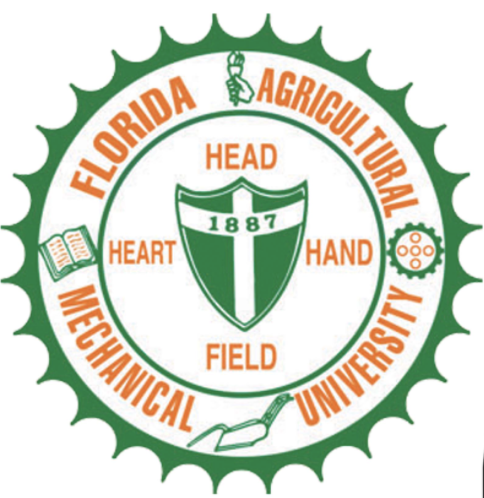
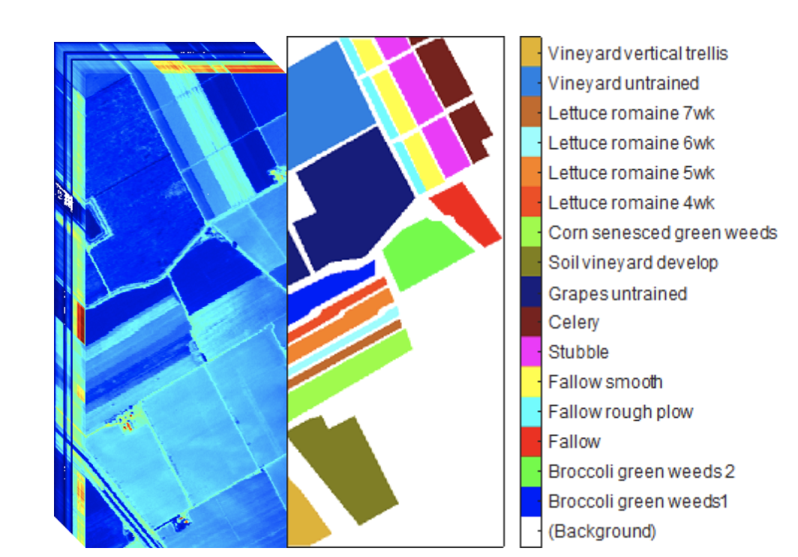
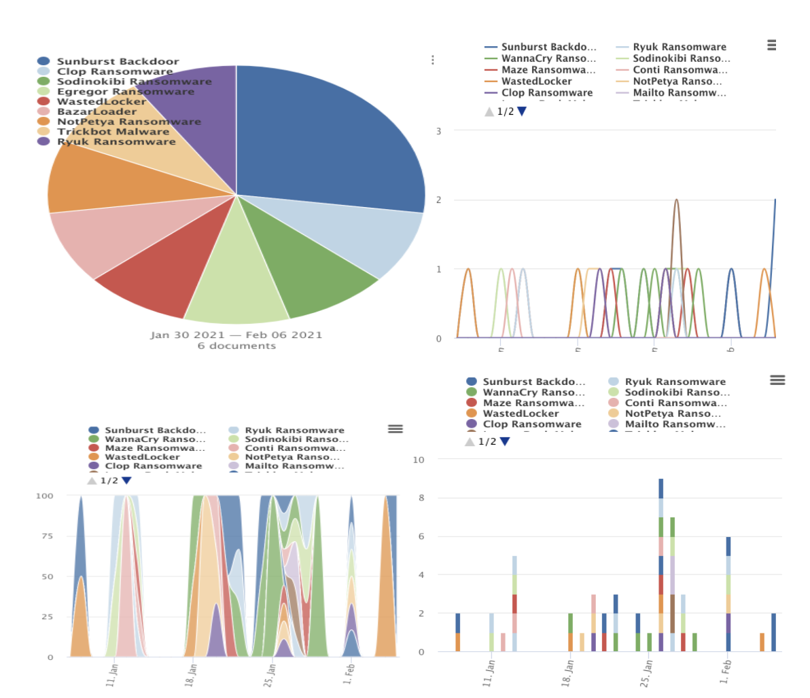

```{r setup, include=FALSE}
knitr::opts_chunk$set(echo = TRUE)
```



## Hands-On Research:  Data Science and Machine Learning Applications for Images and Behavior Analysis

### Models and Methods for Image and Text data with ML.

Why will it be interesting to have you enroll in this summer camp? Would you like to increase your knowledge and creativity using science, technology, mathematics, and you want to know the models used by the most prominent companies to track your interests. In this Hands-On Research for Undergraduates program, we will deliver the main concepts that combine statistical and computational theory to create and train AI (Machine Learning) models for classification and prediction problems in the field of image and Behavior analysis. Hands-On Research will take place on ------------- (8 weeks).    

The summer camp will provide experience in **formulating** and carrying out a tangible **data science analysis** with real-world data. The capstone will be a **group/team project (3/5 students)** and each project will focus in open, pre-existing secondary data.  

Students will be computing with data using popular language like *Python and R*, but also specific languages for transforming and manipulating text, and for managing complex computational pipelines.  

One of the outcomes of the summer project will be to develop a **package that abstract commonly used pieces of workflow** and make them available for use in **future projects**. 

* The student will learn how to analyze and interpret geospatial images to classify the diverse types of vegetation presented in the image.



* Students will learn how to mine text data and find patterns to create knowledge and advanced their research questions.  




* During this summer research program, the student will reach different skills that are demanding by the industry and academic.  
    + To understand the main concepts of statistic and computational algebra to build prediction models. 
    + To learn concepts and improve coding style on python language.
    + To understand and apply different unsupervised and supervised learning methods for images and behavior analysis. 
    + To analyze, visualize and interpretate numerical results. 
    
### Requirements: 

* Basic knowledge in statistic and probability. 
* Basic skill in programming language (preferred Python) 

### Talks:

* AI transformation Industry GCF 1-3 hrs at start 

* Using nanoHUB? ~week 3 2hrs 

* FURY Visualization Elef ~week 3 2-3 hrs 

* Physicell Paul/Randy ~week 4 or 5 3hours 

* CC3D James/TJ ~week 5 or 4 3 hours 

* Project Discussion All IU? Length 

* Possibly 2 mentors from Indiana University

### Dates for Indiana University 

* Jun 7(9:30 am – 10:30 m): Guess-Talk: AI transformation Industry GCF. 

* Jun24(All day) Using nanoHUB? 

* Jun25(All day) FURY Visualization Elef 

* Jul1(All day) JunlGuess-Lecture// CC3D James 

* Jul9(All day) Guess-Lecture// Physicell Paul 

* Jul12() Project Discussion All IU 

### Dates for Speakers  

* Jun 17 Terry Morris (IBM Data Science Academy) 

## Weekly activities feature: 

### Week 1: Intro to Python and R (Jun7-Jun11) 

* Day 1:  

  - 9:30 am – 10:30 m: Guess-Talk: AI transformation Industry 	GCF. 

     + Break: 15 mins 

  - 10:45 am – 12:00 m: 	   

  - Guess-Talk: Hyperspectral Images Classification (30 min.).  

  - Guess-Talk: Ethics in ML and AI (30 min.). 

  - 1:30 pm-2:30 pm: Discuses syllabus.  

* Day 2:  Data Types 

  - (9:30 am- 10:30am) Video/ (10:45 am-12:00 m) F2F 

  - 9:30 am-10:30 am: Working with Integers, Float, Booleans 	and string data types. 

     + Break: 15 mins 

  - 10:45 am – 12:00 m: Examples using strings, integers,     	characters, Booleans and Floats 

  - 1:30 pm-2:30 pm: Lab Activity (with graduate students		(recitals)) 

* Day 3:  Control Structures 

  - (9:30 am- 10:30am) Video/ (10:45 am-12:00 m) F2F 

  - 9:30 am-10:30 am: Working with Conditionals: While, If, Else 	and For Loops 

     + Break: 15 mins 

  - 10:45 am – 12:00 m: Examples using While, If, Else, If and 	For Loops  

  - 1:30 pm-2:30 pm: Lab Activity (with graduate students		(recitals)) 

* Day 4:  Functions 

  - (9:30 am- 10:30am) Video/ (10:45 am-12:00 m) F2F 

  - 9:30 am-10:30 am: Working with predefined functions and 	creating our owns functions.  

     + Break: 15 mins 

  - 10:45 am – 12:00 m: Examples using predefined functions	1:30 pm-2:30 pm: Lab Activity (with graduate students		(recitals)) 

* Day 5:  Lists 

  - (9:30 am- 10:30am) Video/ (10:45 am-12:00 m) F2F 

  - 9:30 am-10:30 am: Working with lists to add, insert items.  

     + Break: 15 mins 

  - 10:45 am – 12:00 m: Examples using Lists that need some 	manipulation for further work. 	 

  - 1:30 pm-2:30 pm: Lab Activity (with graduate students		(recitals)) 
